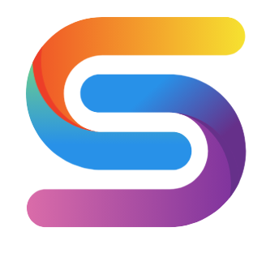
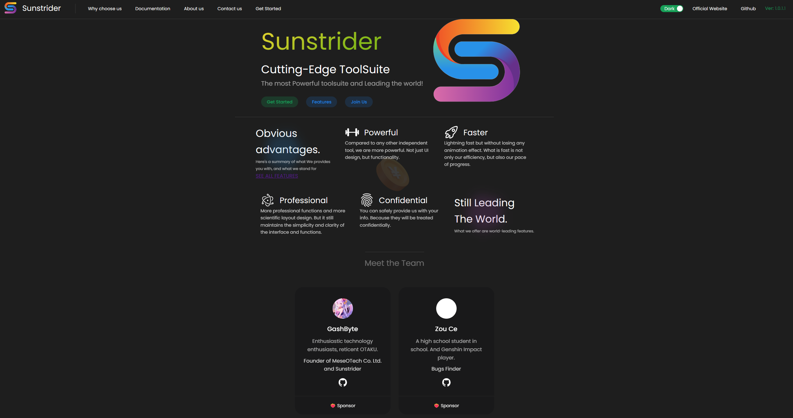
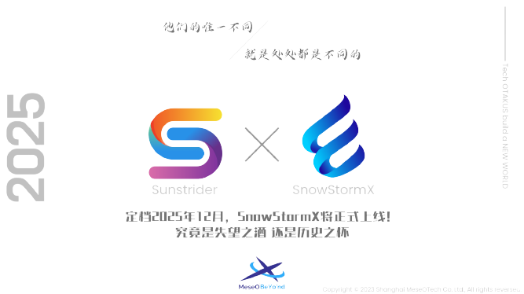

<p align="center">
    
</p>

<h1 align="center">
    <a style="text-decoration: none; color: #fff;" href="https://www.sunstrider.today">SunStrider</a>
</h1>

<p align="center" style="font-size: 18px; color:#e5e5e5A0;">
    Next Generation Integration Toolkit Powered by MeseOTech.
</p>

<p align="Center">

</p>

<p align="center">
    <a href="https://www.meseotech.org/join-us/meseo-public-team" style="text-decoration: underline; font-weight: bold;">Join Us Public Team!</a>
</p>

<p align="center">
    <a style="text-decoration: underline;" href="https://www.meseotech.org/sunstrider/documentation">Documentation</a> | 
    <a style="text-decoration: underline;"  href="https://www.meseotech.org/sunstrider/getting-started">Getting Started</a> | 
    <a style="text-decoration: underline;" href="https://www.meseotech.org/sunstrider/privacy-policy">Privacy Policy</a> | 
    <a style="text-decoration: underline;" href="https://www.meseotech.org/sunstrider/terms-of-service">Terms of Service</a>
</p>

<p align="center">
    <a href="https://www.meseotech.org/sunstrider/cn-documentation" style="text-decoration: underline;">中文文档</a>
</p>

<p align="center">
    <strong>Get Started Preview (10-30-2023)</strong>
</p>



<p align="center">
    <h2>Features</h2>
</p>

> **Powerful**
>
> - **[SunStrider](https://www.sunstrider.today)** has gathered dozens of commonly used tools, condensed the projects that originally required opening **a dozen or dozens** of websites into one website, and made them more refined, better, and more perfect.
>
> **Faster**
>
> - When **animation is supported**, running the page smoothly and efficiently is our goal. **Speed** became our main need without sacrificing aesthetics. Not only the network transmission speed, but also the page rendering speed.
>
> **Professional**
>
> - Our tools do more than just meet the **daily needs** of our users. It is also suitable for every **technical engineer, code developer, and people who are planning and meticulous**. Therefore, our content must be extremely professional. But under this premise, it is still concise and clear, making it easy for everyone to use.
>
> - ~~更适合中国宝宝体质的内卷软件~~

**Star History!**

[](https://star-history.com/#MeseOBeyond/sunstrider&Date)

<div align="center">
    <strong>Based on</strong>
    <br/>
    
    
    
<div>

<br>

<div align="center">
    <strong>UI Design</strong>
    <br/>
    <strong>MeseOTech Design Group + Naive UI</strong>
<div>

<br>

<div align="center">
    <strong>
        OpenSource License
    </strong>
    <br/>
    
<div>

<br/>

**Usage**
> **Visit Our Website**
> 
> [https://www.sunstrider.today](https://www.sunstrider.today)
> or
> [https://www.meseotech.org/sunstrider](https://www.meseotech.org/sunstrider)
> 
> **Download Source(Only Support For STAFF)**
> ```git
> git clone https://www.github.com/MeseOBeyond/sunstrider.git
> ```
>
> ```shell
> cd sunstrider
> ```
>
> ```shell
> npm install
> ```
> 
> ```shell
> npm run format
> ```
> 
> ```shell
> npm run dev
> ```

<br/>

**Contributing**
> Before starting to contribute, You need join our [Public Team](https://www.meseotech.org/join-us/meseo-public-team)  or submit resume to [MeseOTech Co.](https://www.meseotech.org/jobs) to get the permission to contribute.

**Sponsor Us ❤️‍🔥**
> [Sponsor Us!](https://www.meseotech.org/sponsor-us/sunstrider-project) and **30% of this money will be donated to developers**, and the remaining 70% will be used as **charity**!
>
> At present, Sponsors have **initiated 63 donations** to us, and we have received a total of **$2237** and donated **$1565.9** to UNICEF org.

<br/>

<h2 align="center" style="font-size: 18px;">
    A more powerful, developed based on desktop applications
</h2>

<p align="center" style="font-size: 38px;">
    SnowStormX
</p>

<p align="center">
    
</p>

<p align="center">
    SnowStorm Powered by MeseOTech Co Ltd.,
    Will be released in 2025.
</p>

#### Project Depends
[Naive UI](https://www.naiveui.com/)
[Swiper](https://swiper.com.cn/)

#### Special Thanks
[GashByte](https://github.com/gashbyte) Founder of MeseOTech Co. Ltd. and Sunstrider Project

[ZouCe](https://github.com/zou-ce) Bugs Finder. During the limit-testing, he raised 75% of bugs

Zone Su Yuni(no-github) Economic pillars during the internal testing period

[MeseOTech Developers](https://www.meseotech.org/dev/sunstrider) && [MeseOTech Public Team Developers](https://www.meseotech.org/public-team/dev/sunstrider)

<br/>


<p align="center">
    Copyrgiht © 2023 Shanghai MeseOTech Co Ltd., and all contributors , All rights reversed.
</p>
